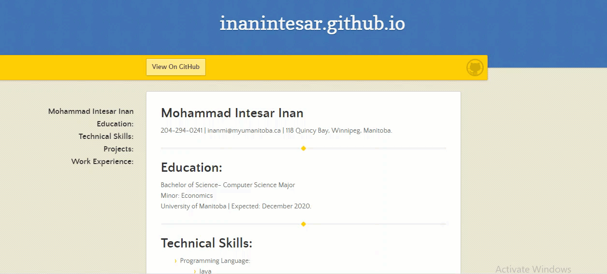

#  LEARNING ETTER’S MODERN TECHNICAL WRITING PRINCIPLES TO HOST AN ONLINE RESUME IN GITHUB  

Acknowledging and understanding a project is conveniently done through README. It contains instructions and material to grasp full knowledge about the project. This readme is meant to give you an overall idea of how to host and format a resume using Markdown, a Markdown editor, GitHub Pages, and Jekyll. The steps described in this readme are followed by _Andrew Etter's Book Modern Technical Writing_ to provide a good quality functional documentation.  

  > WHY README?  
  The major benefit that comes with using README is it's effortless and replies to many regular queries that people will generally ask while installing and using the project.  

---    

# What Is GitHub and Markdown?  

  > GitHub:  
  GitHub is a website for developers and programmers to collaboratively work on code. One of the most important benefit of GitHub is its version control system, which allows for seamless collaboration without the integrity of the original project. Everything on GitHub for example files or project are examples of open-source software.

  > Markdown:  
  Markdown is an alternative to HTML. According to _Etter's Book_ markdown is simultaneously incredible and infuriating, wonderful and maddening. Markdown has become the new standard for text that will be published online. Its one of the most widely used lightweight markup language with the cleanest syntax.

---

# Prerequisites
For this tutorial, you will need two things:

1. A GitHub Account.  

  Like any other signing up process, GitHub also follows the same steps. At the very beginning a [GitHub](www.github.com) account needs to be created by your desirable email address making it more convenient by editing it with your username and securing it with a strong password to avoid any sort of hacking.

2. A Resume.  

  It has also been specified that the resume needs to be written by using Markdown along with the help of an editor. There are plenty of editors for free that you can download depending on which operator you are using. I used [Atom](https://atom.io/) as it blends along smoothly with GitHub as well as contains neat live preview features making my work simpler and makes it more visible that my code is reaching along resulting to be more accommodating. You can see an overview of my resume as a GIF below:

    

---  
# Heading Forward  

  > Once you have a account in GitHub, you can continue downloading **GitHub desktop** on your device and easily sign in with the same email address.

  # Steps
  1. **Building a Repository:**    
   A Repository is a basic option we get once we sign in on our GitHub and
   instructs us to create a repository. Like we do to any of our downloaded
   documents on our pc, we name the file and the same goes for a repository where you enter a name for it. For instance, I have named my repository 'inanintesar.github.io'.

   |Step  |Instructions|
   |:-----:|:------------:|
   |Step 1|Click **+** at the most upper-right corner.|
   |Step 2|Select **New Repository**|
   |Step 3|Enter a suitable name ending with **.github.io** under **Resporitory Name**|
   |Step 4|Click **Private** or **Public** according to the requirement|
   |Step 5|Select **Add a README File**|
   |Step 6|Click **Create Repository**|  

    

  2. **Making the Resume and adding it to Repository:**  

   |Step  |Instructions|
   |:-----:|:------------:|
   |Step 1|Open **GitHub Desktop**|
   |Step 2|Select **Open In Atom**|
   |Step 3|Make your Resume|
   |Step 4|Save your Resume as **index.md** file|
   |Step 5|Go to **GitHub desktop**|
   |Step 6|Click **Commit to main** once you see your updated **index.md**|
   |Step 7|Select **Push Origin**|
   |Step 8|Go to [GitHub](www.github.com) and refresh it.|

   > Finally, you will see your index.md in your repository.  

   
    

  3. **Use Jekyll to add theme in your resume:**

   > According to _Etter's Book_ you should make static websites. Mainly because of their speed, simplicity, portability, and security. You can host static websites practically anywhere, as they require no server-side application dependencies, no databases, and nothing to install, so migrating the entire site is as easy as moving a directory.

   By the help of Jekyll theme you can customize the appearance of your site. Basically,
   Jekyll theme specify plugins and pull out assets, includes and layouts in a way that can be overridden by your site's content. In conclusion, Jekyll is a software which render plain text to static websites.

   |Step  |Instructions|
   |:-----:|:------------:|
   |Step 1|Click **settings** under Repository name.|
   |Step 2|Scroll through **GitHub Pages**|
   |Step 3|Click **Choose a theme**|
   |Step 4|Select a **Theme** from options provided|
   |Step 5|Click **Select Theme**|
   |Step 6|Refresh it.|

   > Adding Jekyll theme will add a new file in your repository named  **_config.yml**.
   This file will hold only the name of the Jekyll theme you selected. I selected Leap Day.

       

---

# More Resources
* Link to more resources:
  * [Andrew Etter's book](https://www.amazon.ca/ModernTechnicalWritingIntroductionDocumentation-ebook/dp/B01A2QL9SS)
  * Markdown Resources:
    * [Markdown Tutorial](markdowntutorial.com)  
    * [Markdown Syntax](https://www.markdownguide.org/basic-syntax/)
    * [Markdown Wikipedia](https://en.wikipedia.org/wiki/Markdown)
  * Markdown Editors:
    * [Atom](https://en.wikipedia.org/wiki/Atom_(text_editor))
    * [Visual Studio Code](https://en.wikipedia.org/wiki/Visual_Studio_Code)
  * Jekyll:
    * [Jekyll Theme](https://jekyllrb.com/docs/themes/#:~:text=Jekyll%20themes%20specify%20plugins%20and,overridden%20by%20your%20site's%20content.)  

---

# FAQs  
 * **Can I get my GitHub repository on my local system?**  
 Yes, you can get your repository on your local system by going to your repository in **GitHub Page** and there you should see an option to download or clone your repository. Once you do that you can use it in your own Desktop.

 * **How do I edit a file once it's pushed to repository?**  
 Go to **GitHub Desktop** open the file that you want to edit. After editing save it. At last host the updated file again in the repository.  

 ---  
# Authors and Acknowledgments  
 * Author: Mohammad Intesar Inan  
 * Group Member
   * [Nicole Ciceron](https://github.com/nicoleciceron/nicoleciceron.github.io)
   * [Shrey Malhan](https://github.com/Shreymalhan1/Shreymalhan1.github.io)  

---  
